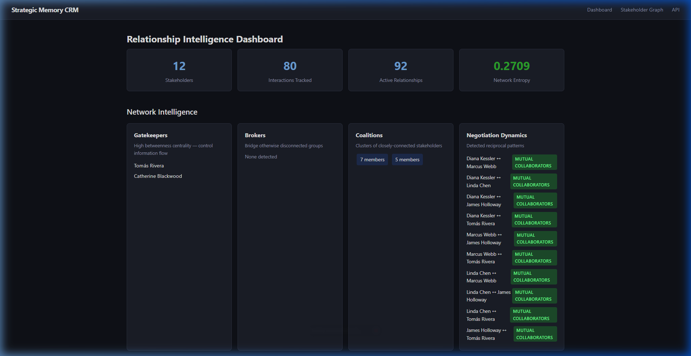
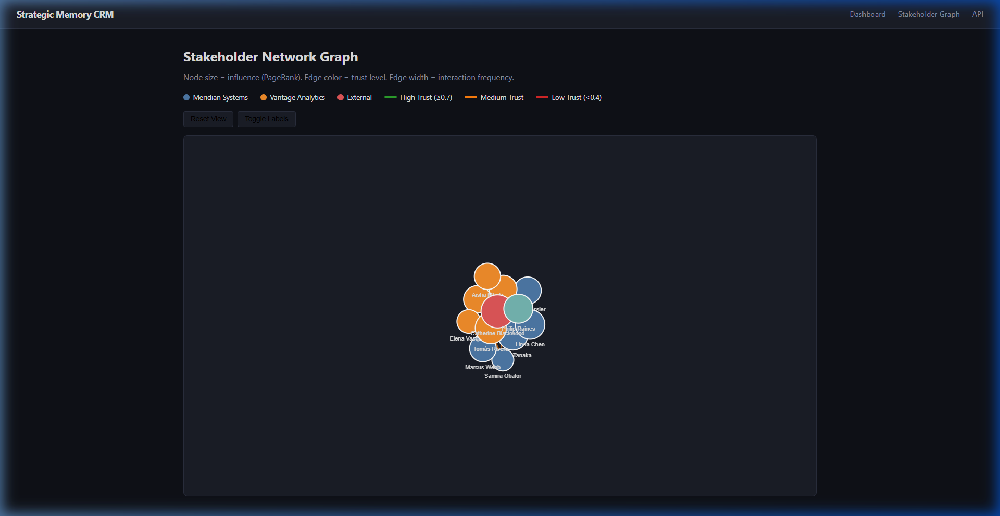
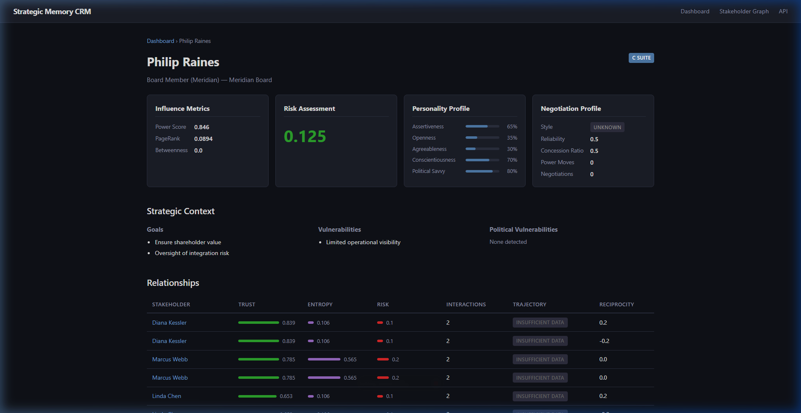
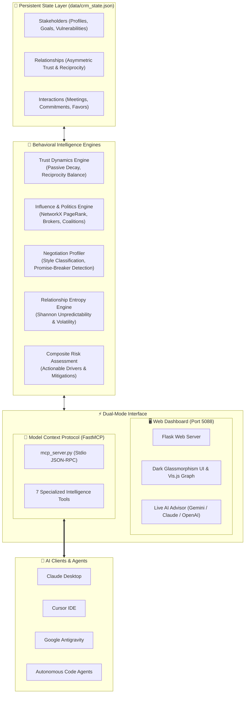

# 🧠 Strategic Memory CRM

<div align="center">

[](https://modelcontextprotocol.io/)
[](https://pypi.org/project/strategic-memory-crm/)
[](https://python.org)
[](https://palletsprojects.com/p/flask/)
[](https://networkx.org/)
[](LICENSE)
[](tests/test_crm.py)
[](https://github.com/adacreativeco/strategic-memory-crm/stargazers)
[](https://github.com/adacreativeco/strategic-memory-crm/releases)

<br/>

**Relationship intelligence over transaction storage.**

[English Documentation](README.md) • [🇹🇷 Türkçe Dokümantasyon](README.tr.md)

</div>

---

A lightweight behavioral intelligence CRM platform and **Model Context Protocol (MCP) Server** that models **trust dynamics, negotiation patterns, influence structures, organizational politics, and relationship risk** — instead of just storing deals and sales pipelines.

Built for strategists, executives, and AI agents navigating complex stakeholder ecosystems where ***who trusts whom* matters more than *who bought what***.

---

## 📸 Visual Showcase

<div align="center">

### 📊 Behavioral Intelligence & Relationship Matrix Dashboard
*Real-time trust scores, reciprocity balance, risk factors, and interaction timelines.*


<br/>

### 🕸️ Interactive Stakeholder Network Graph & Power Structures
*Vis.js network topology highlighting informal influencers, gatekeepers, and hidden coalitions.*


<br/>

### 🎯 Deep Stakeholder Profile & AI Strategic Advisor Battleplan
*Psychometric profiling, negotiation behavioral style, and instant high-stakes pre-meeting briefings.*


</div>

---

## 🏗️ System Architecture



---

## 🔌 Model Context Protocol (MCP) Server

Strategic Memory CRM acts as a dedicated **AI Relationship Memory Layer** over MCP. AI assistants in **Claude Desktop**, **Cursor**, **VS Code**, or **Antigravity** can directly query stakeholder psychometrics, inspect organizational politics, and generate tactical negotiation briefings without opening a browser.

### 🛠️ Exposed MCP Tools

| MCP Tool | Parameters | Description |
|---|---|---|
| `list_stakeholders` | *None* | Returns all stakeholders with organization, role, hierarchy tier, dominant negotiation style, and risk score. |
| `get_stakeholder_intel` | `stakeholder_id` *(id or name)* | Comprehensive behavioral intelligence report: trust ties, psychometrics, reliability, risk drivers, allies, and rivals. |
| `get_organization_politics` | *None* | NetworkX power map: top informal influencers (PageRank), information bridges & gatekeepers (betweenness), and hidden coalitions. |
| `analyze_relationship` | `source_id`, `target_id` | Deep dyadic analysis: asymmetric trust scores, reciprocity balance, Shannon entropy (volatility), and shared interaction history. |
| `log_interaction` | `source_id`, `target_id`, `interaction_type`, `summary`, `sentiment`, `commitments_kept`... | Logs a new meeting/call/favor/conflict, recalculates trust decay/growth, updates reciprocity balance, and saves to database. |
| `add_stakeholder` | `name`, `role`, `organization`, `org_tier`, `personality`, `goals`... | Creates a new stakeholder profile in the strategic memory database with personality traits. |
| `generate_tactical_briefing` | `stakeholder_id`, `meeting_objective` | Generates an executive pre-meeting negotiation battleplan, power lever analysis, and critical pitfalls. |

### 🚀 Claude Desktop & Cursor Setup

Add the following configuration to your `claude_desktop_config.json` or Cursor MCP settings:

```json
{
  "mcpServers": {
    "strategic-memory-crm": {
      "command": "python",
      "args": ["G:/git@adacreativeco/strategic-memory-crm/mcp_server.py"]
    }
  }
}
```

### 💡 Example AI Prompts with MCP

Once connected, ask your AI assistant:
* *"Who are the informal power brokers and gatekeepers in our merger ecosystem?"*
* *"Analyze the trust volatility and political risk between Marcus Vance and Elena Rostova."*
* *"I have a high-stakes alignment meeting with David Chen tomorrow. Generate a tactical negotiation briefing with opening moves and concession boundaries."*
* *"Log a positive negotiation with Sarah Jenkins: she agreed to our Q3 timeline and kept her commitment."*

---

## 🚀 Core Intelligence Engines

### 1. 🤝 Asymmetric Trust Dynamics (`trust.py`)
Trust is modeled as an evolving, directional signal ($A 
ightarrow B 
eq B 
ightarrow A$) influenced by:
* **Passive Temporal Decay:** Unattended relationships decay toward neutral over time ($\lambda = 0.005/	ext{day}$).
* **Reciprocity Balance:** Tracks one-sided favor economies; chronic imbalances induce trust penalties.
* **Commitment Reliability:** Kept commitments award $+0.08$ trust; broken commitments penalize $-0.15$; betrayals penalize $-0.25$.
* **Personality Compatibility:** Psychological affinity nudges trust based on complementary Big-Five traits.

### 2. ⚔️ Negotiation Behavioral Profiler (`negotiation.py`)
Classifies stakeholders into behavioral archetypes based on empirical negotiation history:
* **Dominator:** High frequency of power moves, rarely makes concessions.
* **Accommodator:** Chronic concession maker, avoids direct confrontation.
* **Collaborator:** Balanced give-and-take, high commitment reliability ($>85\%$).
* **Competitor:** Aggressive value claimer with moderate concessions.
* **Pattern Detection:** Identifies *Serial Promise-Breakers*, *Pure Escalators*, *Chronic Yielders*, and *Rapport Builders*.

### 3. 🕸️ Network Centrality & Organizational Politics (`influence.py`)
Powered by **NetworkX**:
* **PageRank Power:** Identifies informal influencers whose opinions cascade through the network.
* **Betweenness Centrality & Articulation Points:** Identifies structural bottlenecks (gatekeepers) and critical communication bridges (brokers).
* **Community Detection:** Uncovers hidden coalitions and informal faction clusters.

### 4. 📈 Shannon Relationship Entropy (`entropy.py`)
Quantifies relationship volatility and unpredictability using information theory:
$$H(X) = -\sum p(x) \log_2 p(x)$$
Combined with trust delta variance and interaction regularity to flag erratic, high-entropy stakeholder ties.

### 5. 🎯 AI Strategic Advisor (`app.py` & `mcp_tools.py`)
Generates structured pre-meeting battleplans with 4 distinct analytical sections:
1. **Psychological Diagnosis:** Core drivers, hidden agendas, and mindset.
2. **Strategic Leverage & Vulnerabilities:** Identified soft spots and leverage anchors.
3. **Tactical Playbook:** Opening framing, concession strategy, and closing techniques.
4. **Critical Pitfalls:** Psychological landmines to avoid.

---

## 🛠️ Quick Start

### 1. Clone & Install Dependencies
```bash
git clone https://github.com/adacreativeco/strategic-memory-crm.git
cd strategic-memory-crm
pip install -r requirements.txt
```

### 2. Run the Web Dashboard
```bash
python app.py
```
Open [http://localhost:5088](http://localhost:5088) in your browser.

### 3. Run the MCP Server
```bash
python mcp_server.py
```

### 4. Run Automated Test Suite
```bash
python -m unittest discover tests
```

---

## 📂 Project Structure

```
strategic-memory-crm/
├── app.py                          # Flask web dashboard & REST API server
├── mcp_server.py                   # Model Context Protocol (MCP) server entry point
├── pyproject.toml                  # Standard Python package metadata & scripts
├── requirements.txt                # Production dependencies (Flask, NetworkX, NumPy, SciPy, MCP)
├── strategic_memory_crm/
│   ├── models.py                   # Core dataclasses (Stakeholder, Interaction, Relationship, CRMState)
│   ├── storage.py                  # Real-time JSON persistence load & save engine
│   ├── trust.py                    # Asymmetric trust dynamics & passive decay engine
│   ├── negotiation.py              # Behavioral negotiation profiling & pattern detection
│   ├── influence.py                # Graph centrality, gatekeepers, brokers & coalitions (NetworkX)
│   ├── entropy.py                  # Shannon entropy & relationship volatility scoring
│   ├── risk.py                     # Composite risk assessment & actionable mitigations
│   ├── mcp_tools.py                # Modular MCP behavioral intelligence tools
│   ├── graph.py                    # Vis.js JSON graph serialization
│   ├── simulation.py               # Interaction history simulator
│   └── dataset.py                  # Fictional corporate M&A dataset generator
├── templates/                      # Jinja2 HTML templates
│   ├── base.html                   # Dark-themed master layout
│   ├── dashboard.html              # Relationship matrix, statistics & action modals
│   ├── stakeholder.html            # Profile, timeline & AI Strategic Advisor
│   └── graph.html                  # Interactive Vis.js network graph
├── static/
│   └── style.css                   # Responsive dark UI styling
├── tests/
│   ├── test_crm.py                 # Core CRM behavioral engine unit test suite
│   └── test_mcp.py                 # MCP server & tools unit test suite (25 tests total)
└── data/
    └── crm_state.json              # Persistent database state
```

---

## 📄 License

Distributed under the Apache 2.0 License. See [LICENSE](LICENSE) for details.

---

<div align="center">
Built with 🧠 by <a href="https://github.com/adacreativeco">ADA Creative Co.</a>
</div>
