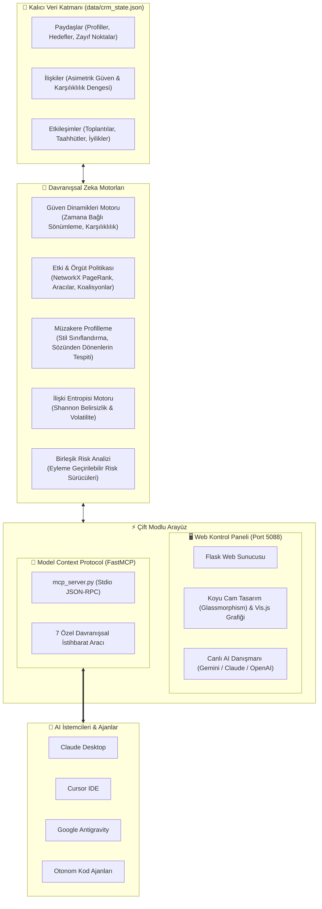

# 🧠 Strategic Memory CRM

<div align="center">

[](https://modelcontextprotocol.io/)
[](https://pypi.org/project/strategic-memory-crm/)
[](https://python.org)
[](https://palletsprojects.com/p/flask/)
[](https://networkx.org/)
[](LICENSE)
[](tests/test_crm.py)
[](https://github.com/adacreativeco/strategic-memory-crm/stargazers)
[](https://github.com/adacreativeco/strategic-memory-crm/releases)

<br/>

**İşlem depolamak yerine ilişki ve davranış zekası yönetimi.**

[🇹🇷 Türkçe Dokümantasyon](README.tr.md) • [🇺🇸 English Documentation](README.md)

</div>

---

Yalnızca satış anlaşmalarını ve boru hatlarını (pipeline) tutmak yerine **güven dinamiklerini, müzakere modellerini, etki yapılarını, organizasyonel politikayı ve ilişki riskini** modelleyen davranışsal zeka CRM platformu ve **Model Context Protocol (MCP) Sunucusu**.

Kimin kime güvendiğinin kimin ne satın aldığından daha önemli olduğu karmaşık paydaş ekosistemlerinde stratejistler, yöneticiler ve yapay zekâ ajanları için tasarlanmıştır.

---

## 📸 Görsel Vitrin

<div align="center">

### 📊 Davranışsal Zeka & İlişki Matrisi Kontrol Paneli
*Gerçek zamanlı güven puanları, karşılıklılık dengesi, risk faktörleri ve etkileşim zaman çizelgesi.*


<br/>

### 🕸️ Etkileşimli Paydaş Ağ Grafiği & Güç Yapıları
*Gayriresmi liderleri, bilgi bekçilerini ve gizli koalisyonları öne çıkaran Vis.js ağ topolojisi.*


<br/>

### 🎯 Detaylı Paydaş Profili & Yapay Zeka Taktiksel Savaş Planı
*Psikometrik profilleme, müzakere davranış stili ve anlık toplantı öncesi taktiksel brifingler.*


</div>

---

## 🏗️ Sistem Mimarisi



---

## 🔌 Model Context Protocol (MCP) Sunucusu

Strategic Memory CRM, yapay zekâ asistanları için **Stratejik İlişki Hafıza Katmanı** sunar. **Claude Desktop**, **Cursor**, **VS Code** veya **Antigravity** içinden doğrudan paydaş profillerini sorgulayabilir, müzakere risklerini hesaplayabilir, güç haritalarını inceleyebilir ve toplantı öncesi taktiksel brifingler üretebilirsiniz.

### 🛠️ Erişilebilir MCP Araçları

| MCP Aracı | Parametreler | Açıklama |
|---|---|---|
| `list_stakeholders` | *Yok* | Tüm paydaşları unvan, şirket, hiyerarşi, kişilik özellikleri ve risk puanıyla listeler. |
| `get_stakeholder_intel` | `stakeholder_id` *(id veya isim)* | Bir paydaş hakkında derin istihbarat sunar (güven bağları, müzakere stili, güvenilirlik, risk faktörleri, müttefik/rakipler). |
| `get_organization_politics` | *Yok* | NetworkX destekli yapısal güç haritasını çıkarır (PageRank ile gayriresmi liderler, bilgi bekçileri, aracılar, koalisyonlar). |
| `analyze_relationship` | `source_id`, `target_id` | İki kişi arasındaki ikili ilişkiyi analiz eder (yönlü güven, iyilik dengesi, entropi/volatilite, etkileşim geçmişi). |
| `simulate_scenario` | `scenario_type`, `source_id`, `target_id`... | "What-If" Kriz & Müzakere Simülatörü: ağ entropi kaymalarını, güven dalgalanmasını ve hasar kontrol önerilerini hesaplar. |
| `get_coalition_radar` | *Yok* | Koalisyon güç analizi: kliklerin toplam karar gücü payı (%), liderler ve en zayıf halka (weakest link) tespiti. |
| `compare_stakeholders` | `source_id`, `target_id` | İkili lider karşılaştırması: psikometri, müzakere arketipi, karşılıklı güven ve ortak müttefik/rakipler. |
| `log_interaction` | `source_id`, `target_id`, `interaction_type`, `summary`, `sentiment`... | Yeni görüşme, arama veya taahhütleri dinamik güven sönümlemesi ve karşılıklılık güncellemeleriyle kaydeder. |
| `add_stakeholder` | `name`, `role`, `organization`, `org_tier`, `personality`... | Stratejik hafıza veritabanına kişilik özellikleriyle birlikte yeni bir paydaş ekler. |
| `generate_tactical_briefing` | `stakeholder_id`, `meeting_objective` | Toplantı öncesi anlık psikometrik müzakere savaş planı ve taktiksel kaldıraç noktaları üretir. |

### 🚀 Claude Desktop & Cursor Kurulumu

`claude_desktop_config.json` veya Cursor MCP ayarlarına ekleyin:

```json
{
  "mcpServers": {
    "strategic-memory-crm": {
      "command": "python",
      "args": ["G:/git@adacreativeco/strategic-memory-crm/mcp_server.py"]
    }
  }
}
```

### 💡 MCP ile Örnek AI Komutları

Bağlantı kurulduktan sonra yapay zekâ asistanınıza şunları sorabilirsiniz:
* *"Şirket birleşmesi sürecindeki gayriresmi güç odakları ve bilgi bekçileri kimler?"*
* *"Marcus Vance ile Elena Rostova arasındaki ilişki riskini ve güven oynaklığını analiz et."*
* *"Yarın David Chen ile kritik bir toplantım var. Açılış hamleleri ve taviz sınırları içeren taktiksel bir müzakere planı hazırla."*
* *"Sarah Jenkins ile olumlu bir görüşme kaydet: Q3 takvimimize onay verdi ve taahhüdünü yerine getirdi."*

---

## 🚀 Çekirdek Zeka Motorları

### 1. 🤝 Asimetrik Güven Dinamikleri (`trust.py`)
Güven, zamana bağlı ve yönlü bir sinyal ($A 
ightarrow B 
eq B 
ightarrow A$) olarak modellenir:
* **Zamansal Sönümleme (Passive Decay):** İletişim kurulmayan ilişkiler zamanla nötre doğru geriler ($\lambda = 0.005/	ext{gün}$).
* **Karşılıklılık Dengesi (Reciprocity):** Tek taraflı iyilikleri takip eder; kronik dengesizlikler güven cezasına yol açar.
* **Taahhüt Güvenilirliği:** Tutulan sözler $+0.08$ güven kazandırır; tutulmayan sözler $-0.15$, ihanetler $-0.25$ ceza alır.
* **Kişilik Uyumu:** Big-Five kişilik özellikleri arasındaki uyum güvene pozitif ivme katar.

### 2. ⚔️ Müzakere Davranış Profilleme (`negotiation.py`)
Paydaşları geçmiş müzakere davranışlarına göre arketipik olarak sınıflandırır:
* **Dominant (Dominator):** Güç gösterisi yüksek, nadiren taviz verir.
* **Uyumlu (Accommodator):** Kronik taviz veren, çatışmadan kaçınan.
* **İşbirlikçi (Collaborator):** Dengeli al-ver dengesi, yüksek güvenilirlik ($>\%85$).
* **Yarışmacı (Competitor):** Agresif avantaj arayan, sınırlı taviz veren.
* **Kalıp Tespiti:** *Sözünden Dönenler*, *Kronik Tavizciler*, *Tırmandırıcılar* ve *Köprü Kuranlar*.

### 3. 🕸️ Ağ Merkeziliği & Örgütsel Politika (`influence.py`)
**NetworkX** kütüphanesinden güç alır:
* **PageRank Etki Gücü:** Ağ içerisinde fikirleri dalga dalga yayılan gayriresmi liderleri bulur.
* **Aracılık Merkeziliği (Betweenness) & Köprü Düğümler:** İletişim darboğazlarını (gatekeepers) ve kritik aracıları (brokers) tespit eder.
* **Topluluk Tespiti:** Ağdaki gizli çıkar gruplarını ve koalisyonları ortaya çıkarır.

### 4. 📈 Shannon İlişki Entropisi (`entropy.py`)
İlişkilerin oynaklığını ve öngörülemezliğini bilgi teorisiyle ölçer:
$$H(X) = -\sum p(x) \log_2 p(x)$$
Güven dalgalanması (volatilite) ve etkileşim periyodu ile birleştirilerek riskli ilişkileri önceden tespit eder.

### 5. 🎯 Canlı Yapay Zeka Strateji Danışmanı (`app.py` & `mcp_tools.py`)
Toplantı öncesinde 4 ana başlıktan oluşan taktiksel savaş planı üretir:
1. **Psikolojik Teşhis:** Temel motivasyonlar, gizli ajandalar ve zihniyet.
2. **Stratejik Kaldıraç & Zayıf Noktalar:** Hassas noktalar ve güç dayanakları.
3. **Taktik Oyun Planı:** Açılış çerçevesi, taviz taktiği ve kapanış stratejisi.
4. **Kritik Hatalar:** Asla yapılmaması gereken davranışlar.

---

## 🛠️ Hızlı Başlangıç

### 1. Repoyu Klonlayın ve Bağımlılıkları Yükleyin
```bash
git clone https://github.com/adacreativeco/strategic-memory-crm.git
cd strategic-memory-crm
pip install -r requirements.txt
```

### 2. Web Kontrol Panelini Başlatın
```bash
python app.py
```
Tarayıcınızda [http://localhost:5088](http://localhost:5088) adresini açın.

### 3. MCP Sunucusunu Başlatın
```bash
python mcp_server.py
```

### 4. Birim Testleri Çalıştırın
```bash
python -m unittest discover tests
```

---

## 📂 Proje Mimarisi

```
strategic-memory-crm/
├── app.py                          # Flask web kontrol paneli & REST API sunucusu
├── mcp_server.py                   # Model Context Protocol (MCP) sunucu giriş noktası
├── pyproject.toml                  # Standart Python paket metaverileri ve betikleri
├── requirements.txt                # Bağımlılıklar (Flask, NetworkX, NumPy, SciPy, MCP)
├── strategic_memory_crm/
│   ├── models.py                   # Veri sınıfları (Stakeholder, Interaction, Relationship, CRMState)
│   ├── storage.py                  # Gerçek zamanlı JSON yükleme & kaydetme motoru
│   ├── trust.py                    # Asimetrik güven dinamikleri & zamansal sönümleme motoru
│   ├── negotiation.py              # Davranışsal müzakere profilleme & kalıp tespiti
│   ├── influence.py                # Çizge merkeziliği, bilgi bekçileri, aracılar & koalisyonlar (NetworkX)
│   ├── entropy.py                  # Shannon entropisi & ilişki oynaklığı puanlama
│   ├── risk.py                     # Birleşik risk analizi & hafifletme önerileri
│   ├── mcp_tools.py                # Modüler MCP davranışsal zeka araçları
│   ├── graph.py                    # Vis.js JSON çizge serileştirme
│   ├── simulation.py               # Etkileşim geçmişi simülatörü
│   └── dataset.py                  # Örnek şirket birleşmesi (M&A) veri seti üreticisi
├── templates/                      # Jinja2 HTML şablonları
│   ├── base.html                   # Koyu temalı ana düzen
│   ├── dashboard.html              # İlişki matrisi, istatistikler & aksiyon modalları
│   ├── stakeholder.html            # Paydaş profili, zaman çizelgesi & AI Danışmanı
│   └── graph.html                  # Etkileşimli Vis.js ağ grafiği
├── static/
│   └── style.css                   # Duyarlı koyu UI tasarımı
├── tests/
│   ├── test_crm.py                 # Temel CRM davranış motoru test paketi
│   └── test_mcp.py                 # MCP sunucu ve araçları test paketi (toplam 25 test)
└── data/
    └── crm_state.json              # Kalıcı veritabanı durumu
```

---

## 📄 Lisans

Apache 2.0 Lisansı ile dağıtılmaktadır. Detaylar için [LICENSE](LICENSE) dosyasına bakabilirsiniz.

---

<div align="center">
🧠 <a href="https://github.com/adacreativeco">ADA Creative Co.</a> tarafından geliştirilmiştir.
</div>
